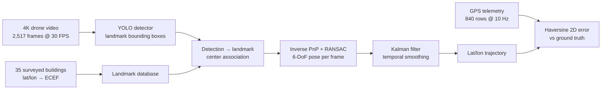
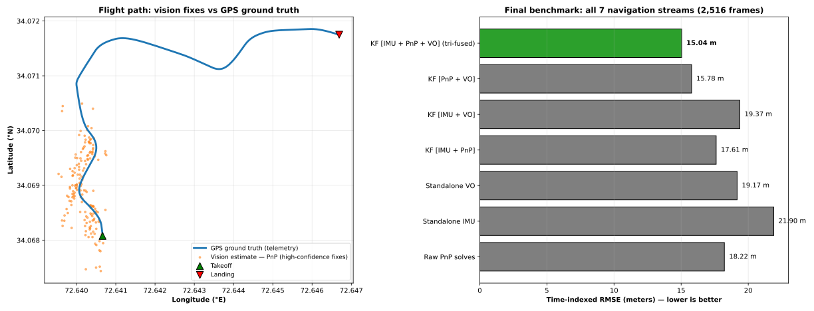

# Vision-Based UAV Navigation (GPS-Denied)

> **Research project** — vision-only drone localization that fuses YOLO landmark detection, PnP pose estimation, and Kalman filtering. No GPS required at inference time; GPS telemetry is used only as ground truth for evaluation.

Conducted as an independent research project by **Imran Tahir**, under the mentorship of **Qaiser Awan**.

---

## The problem

Consumer drones lean on GPS, which fails indoors, in urban canyons, and under jamming/spoofing. This project asks: *can a drone localize itself using only what its camera sees, matched against a surveyed map of 3D landmarks?*

## Pipeline



1. **Landmark database** — 35 buildings surveyed with latitude/longitude, converted to ECEF Cartesian coordinates (`data/building_ecef_coordinates.txt`).
2. **Detection** — YOLOv8n (30 epochs) and YOLO26s (20 epochs) trained on 315 annotated aerial frames. Per-frame detection centers are matched to landmark IDs.
3. **Pose estimation** — inverse PnP solved per frame with `solvePnPRansac` against the 3D landmark map → raw position estimate.
4. **Fusion** — a Kalman filter smooths the raw PnP trajectory over time. Monocular visual odometry (Lucas–Kanade optical flow) and IMU dead reckoning were also prototyped and evaluated — both diverged on this flight, and are documented below as negative results.
5. **Evaluation** — 2D haversine error against GPS telemetry across the full 83.9-second flight.

## Verified results

Final benchmark run (cell 62 of the pipeline notebook) — all 7 navigation streams evaluated on 2,516 video frames, each scored two ways: standard time-indexed RMSE and the geometric-mean nearest-neighbor distance (`scipy.spatial.distance.cdist`, the supervisor's evaluation metric):

| Navigation stream | Time-indexed RMSE | Geometric mean (cdist) |
|---|---|---|
| Raw PnP solves | 18.22 m | 9.77 m |
| Standalone IMU | 21.90 m | 9.11 m |
| Standalone VO (optical flow) | 19.17 m | 6.79 m |
| KF [IMU + PnP] | 17.61 m | 10.84 m |
| KF [IMU + VO] | 19.37 m | 6.88 m |
| KF [PnP + VO] | 15.78 m | 8.85 m |
| **KF [IMU + PnP + VO] (tri-fused)** | **15.04 m** | **9.04 m** |

- **15.04 m RMSE** on the tri-fused output — **31.3% better than the standalone-IMU baseline** (21.90 m).
- **9.04 m** is the geometric-mean distance under the supervisor's cdist metric (a nearest-neighbor measure, more forgiving than time-indexed RMSE — reported separately, as the code does).

**How the result was earned (kept honest):** an earlier run of the same script (cell 61) had the optical-flow VO diverge to 227.40 m RMSE, dragging the tri-fused output to 62.10 m. Reworking VO into a pure sequential tracker brought it to 19.17 m and unlocked the fusion gain. The July-2026 CSVs in [`evaluation/`](evaluation/) capture that earlier snapshot (raw PnP 57.78 m MAE → Kalman-fused 36.60 m MAE over 1,408 valid frames); the table above is the final word.


*Left: GPS ground-truth flight path with high-confidence vision fixes. Right: all 7 navigation streams — the tri-fused Kalman filter (IMU + PnP + VO) wins at 15.04 m RMSE.*

## Repository contents

```
├── data/
│   ├── building_ecef_coordinates.txt     # 35 surveyed landmarks (lat/lon → ECEF)
│   └── sample_label.txt                  # Example polygon annotation (YOLO-seg format)
├── evaluation/                           # Raw evaluation outputs
│   ├── inverse_pnp_frame_results.csv     # Per-frame PnP solutions + errors
│   └── *_evaluation.txt / *report.txt    # Experiment reports
├── results/
│   └── plots/clean_benchmark_overview.svg  # Flight path + benchmark figure
└── requirements.txt
```

The complete research materials — full pipeline notebooks, YOLO training notebook, 4K dataset (315 annotated frames, 316 MB), and flight videos — are archived separately; contact for access.

## Reproduce

```bash
pip install -r requirements.txt
```

The evaluation artifacts above (per-frame PnP solutions, experiment reports, landmark coordinates) reproduce the benchmark table. Camera intrinsics used throughout: `fx = fy = 2800`, `cx = 1920`, `cy = 1080` (3840×2160 @ 30 FPS). The full pipeline and training notebooks are available on request (see above).

## Tech stack

Python · Ultralytics YOLO (v8n, 26s) · OpenCV (`solvePnPRansac`, Lucas–Kanade optical flow) · NumPy/pandas · Matplotlib · pyproj (geodetic ↔ ECEF) · SciPy
